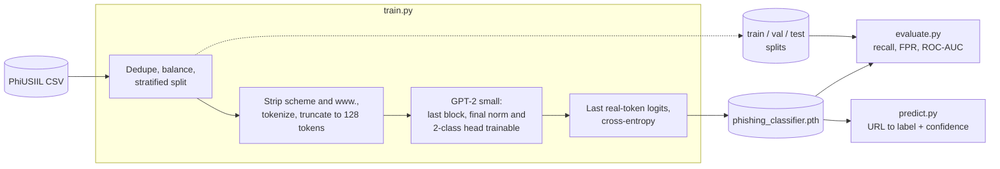

# Phishing URL Classifier

Classifies URLs as phishing or legitimate by fine-tuning GPT-2 small (124M) on the PhiUSIIL dataset. Only the last transformer block, the final norm and a new 2-class head are trained.

## Setup

```bash
pip install -e .[pretrain]
```

The `pretrain` extra (TensorFlow, requests, tqdm) is needed to download the GPT-2 weights for training. Evaluation and prediction only need `pip install -e .`.

Download the [PhiUSIIL Phishing URL dataset](https://archive.ics.uci.edu/dataset/967/phiusiil+phishing+url+dataset) and place it at `data/PhiUSIIL_Phishing_URL_Dataset.csv`.

## Usage

```bash
python scripts/train.py # prepares splits, trains, saves model/phishing_classifier.pth
python scripts/evaluate.py # metrics on the test split
python scripts/predict.py <url> [<url> ...] # classify URLs
```

Run `python scripts/train.py --help` or `python scripts/evaluate.py --help` for options.

## How it works



## Results

Test set: 4,000 URLs (2,000 phishing, 2,000 legitimate) from websites that never appear in training. Phishing is the positive class and the threshold is 0.5.

| Metric | Value |
|---|---|
| Accuracy | 87.65% |
| Phishing precision | 0.968 |
| Phishing recall | 0.779 |
| False positive rate | 2.55% |
| ROC-AUC | 0.930 |
| PR-AUC | 0.949 |
| MCC | 0.768 |
| Recall at 1% FPR | 0.750 |
| Recall at 0.1% FPR | 0.683 |

Validation accuracy of the saved checkpoint: 89.30%. Setup: 20k balanced URLs (14k train / 2k validation / 4k test) split by registered domain, 2 epochs, batch size 32, learning rate 1e-3 for the head and 5e-5 for the last block and final norm, trained on CPU in about 73 minutes.

Threshold trade-off (a higher threshold flags fewer URLs):

| Threshold | Phishing recall | False positive rate |
|---|---|---|
| 0.1 | 0.972 | 0.651 |
| 0.3 | 0.850 | 0.111 |
| 0.5 | 0.779 | 0.026 |
| 0.7 | 0.733 | 0.009 |
| 0.9 | 0.667 | 0.000 |

## Lessons: a 99.6% score that was too good

The first version scored 99.60% on a random split of raw URLs. It was misleading:

- **Shortcut features.** The same site flipped between phishing and legitimate depending on whether `https://` or `www.` was present, because the legitimate URLs in the dataset mostly start with `https://www.`. Fix: strip the scheme and a leading `www.` in training and inference (`components/preprocessing.py`).
- **Domain leakage.** A random split put URLs from the same site in both train and test. Fix: split by registered domain, so every test site is unseen (`components/data.py`).

| Setup | Test accuracy |
|---|---|
| Random URL split, raw URLs | 99.60% |
| Domain split, normalized URLs | 87.65% |

## Limitations

- **URL text only.** No domain age, reputation or page content, and no notion of brand popularity: `google.com` scores only about 67% legitimate.
- **Low recall at the default threshold.** About 22% of phishing URLs are missed, and most errors are missed phishing. Lowering the threshold catches more at the cost of many false positives.
- **Balanced test set.** Real traffic is mostly legitimate, so precision in practice would be lower than reported.
- **Small training subset.** Trained on 20k of the dataset's roughly 235k URLs, with only the last transformer block unfrozen. More data and unfreezing more layers are untested.

## Tests

```bash
pip install -e .[dev]
pytest
```

## Project structure

```
components/   model, data, training, metrics, evaluation, inference
tests/        unit tests
notebooks/    experiments
data/         raw dataset and train/validation/test splits (not tracked)
model/        trained weights and run metrics
scripts/      train.py  evaluate.py  predict.py
```

## Acknowledgements

Parts of the model implementation are based on and adapted from
Sebastian Raschka's *Build a Large Language Model (From Scratch)*.

The original code is licensed under the Apache License, Version 2.0.